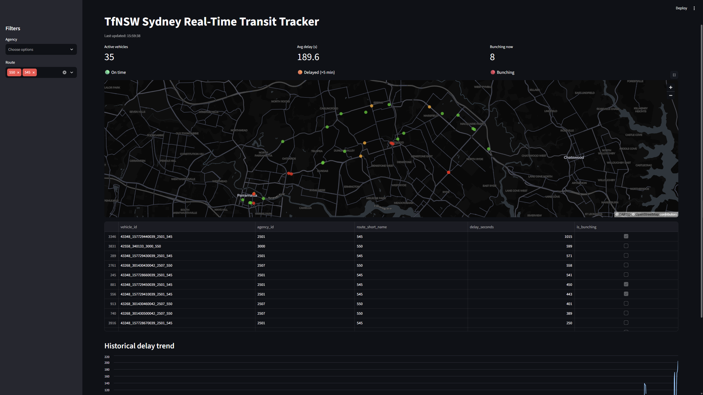

# TfNSW Real-Time Transit Tracker

A real-time data streaming and analytics platform for Sydney public transit, built with Apache Kafka, Apache Flink, and AWS. Live vehicle positions are decoded, joined with trip-delay data, checked for bus "bunching," and served through an interactive dashboard.

**⚠️ Project status: in active development.** Core streaming pipeline (Kafka → Flink → DynamoDB/S3) and the Streamlit dashboard are functional against live data. Containerization, CI/CD, and cloud deployment are still in progress — see [Roadmap](#roadmap).



## What it does

- Polls Transport for NSW's GTFS-realtime feeds (vehicle positions + trip updates) every ~15s
- Streams raw data through Kafka (Redpanda)
- Processes it in Apache Flink: decodes protobuf, joins agency-reported delay onto live positions via a stateful keyed join, and detects bus bunching using proximity + heading analysis
- Writes live state to DynamoDB and historical batches to an S3 Parquet data lake
- Visualizes everything in a Streamlit dashboard: live map, delay/bunching KPIs, filterable by agency and route, with a historical delay trend chart queried directly from S3 via DuckDB

## Architecture

```
TfNSW GTFS-realtime API
        │
   Producer (Python)
        │
     Kafka (Redpanda)
        │
   Apache Flink (PyFlink)
   ├── decode protobuf
   ├── join delay by trip_id (keyed co-process)
   └── detect bunching (proximity + bearing)
        │
   ┌────┴────┐
DynamoDB    S3 (Parquet)
   │            │
   └── Streamlit dashboard (live map + historical trends via DuckDB)
```

## Tech stack

Python · Apache Kafka (Redpanda) · Apache Flink (PyFlink) · AWS (DynamoDB, S3, IAM) · Terraform · Streamlit · pydeck · DuckDB · boto3 · pytest

## Notable design decisions

- **Cost-conscious infrastructure**: self-hosted Kafka/Flink instead of managed equivalents (MSK, Managed Flink), which would cost hundreds of dollars a month even sitting idle
- **Direction-aware bunching detection**: uses vehicle `bearing` alongside proximity, avoiding false positives from vehicles simply passing each other in opposite directions
- **AWS-native storage**: DynamoDB and S3 used throughout development for live state and historical data, rather than a local emulator

## Roadmap

- [x] Kafka + Flink streaming pipeline (decode, delay join, bunching detection)
- [x] Dual-sink storage (DynamoDB live state, S3 historical data lake)
- [x] Streamlit dashboard with live map, KPIs, and filters
- [ ] Containerize all services (Docker)
- [ ] CI pipeline (lint + test on every PR)
- [ ] Terraform-managed AWS demo deployment
- [ ] CloudWatch monitoring (throughput, latency, volume metrics)

## Running locally

Requires Docker, Python 3.11+, Java 11 (for PyFlink), and an AWS account.

```bash
# 1. Start local Kafka
cd infra/docker && docker compose up -d

# 2. Start the producer (polls TfNSW, publishes to Kafka)
cd producer && python producer.py

# 3. Start the Flink job (processes + writes to DynamoDB/S3)
cd flink-job && python flink_job.py

# 4. Start the dashboard
cd dashboard && streamlit run app.py
```

Requires a TfNSW Open Data API key and AWS credentials configured locally (`.env` and `aws configure`).